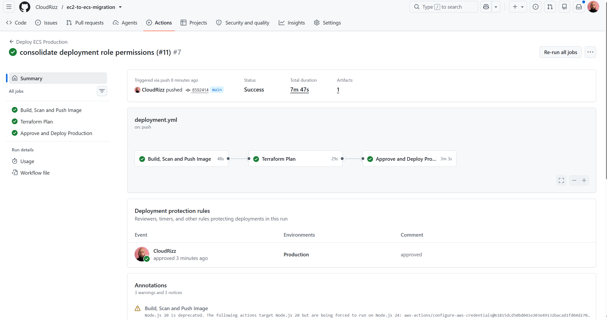
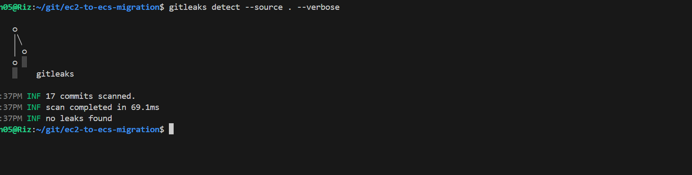
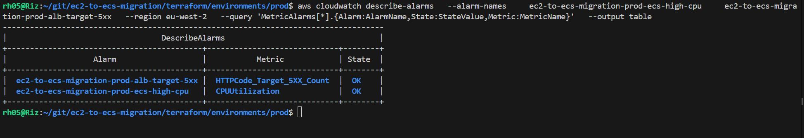
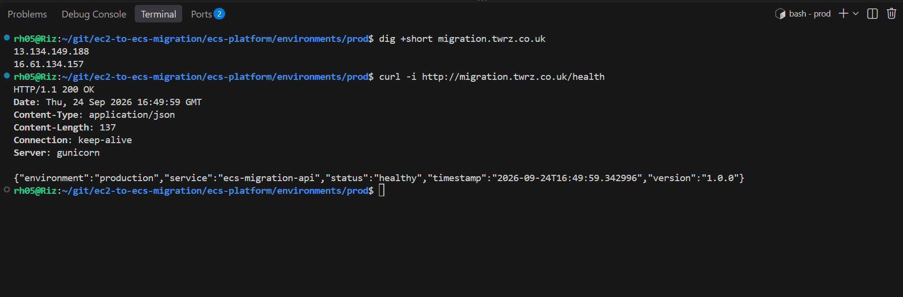
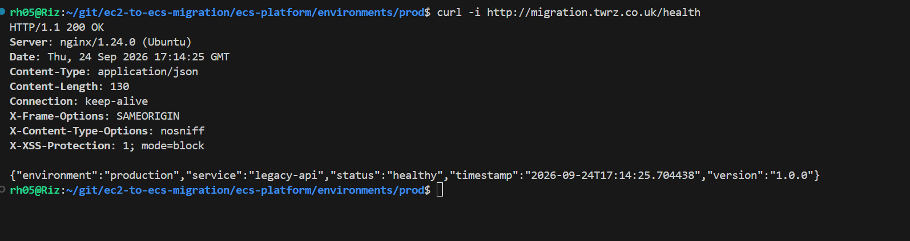
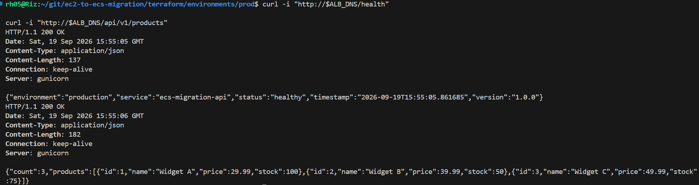

# EC2 to ECS Production Migration

A production-style migration of a legacy Python Flask API from a single AWS EC2 instance to a containerised, highly available Amazon ECS Fargate platform.

The project demonstrates the complete migration lifecycle rather than simply deploying a new environment. The existing EC2 application was first validated and containerised with Docker before a new AWS platform was provisioned using Terraform. The application was then deployed to ECS Fargate behind an Application Load Balancer, with private application workloads, multi-AZ networking, Amazon ECR, Route 53, CloudWatch observability and automated CI/CD through GitHub Actions.

The deployment pipeline uses GitHub OIDC for short-lived AWS authentication, applies security scanning to container images before deployment, enforces pull request approval before code changes are merged, generates a Terraform plan for review, and requires a separate manual approval before any production infrastructure changes are applied.

A controlled DNS cutover was used to move `migration.twrz.co.uk` from the legacy EC2 environment to ECS. The rollback process was also tested by routing production traffic back to the original EC2 instance before restoring ECS, demonstrating that the migration could be reversed safely.

The project finishes with a controlled teardown process covering the ECS platform, legacy infrastructure, bootstrap resources, versioned Terraform state, ECR images and supporting AWS-created resources.

## 🔎 Project at a Glance


## 🧰 Tech Stack

This migration project uses a production-style AWS container platform with Infrastructure as Code, automated CI/CD, security scanning, observability, and controlled rollback/teardown.


### Core Technologies

| Technology | Purpose |
|---|---|
| **AWS ECS Fargate** | Runs the containerised Flask application without managing EC2 hosts |
| **Amazon ECR** | Stores immutable application container images |
| **Application Load Balancer** | Routes public HTTP traffic to healthy ECS tasks |
| **Route 53** | Provides DNS cutover between legacy EC2 and ECS |
| **Terraform** | Provisions the bootstrap, networking, ECS, ALB, IAM and observability infrastructure |
| **Docker** | Packages the Flask application into a portable non-root container |
| **GitHub Actions** | Builds, scans, pushes, plans and deploys the application |
| **GitHub OIDC** | Provides temporary AWS credentials without long-lived access keys |
| **CloudWatch** | Provides application logs, Container Insights, metrics and alarms |
| **Python / Flask** | Application runtime and API |
| **Gunicorn** | Production WSGI server used by the Flask application |
| **NGINX** | Reverse proxy used by the original legacy EC2 deployment |
| **Bash / AWS CLI** | Validation, operational checks and controlled teardown |

## 🏗️ Architecture
The original application ran on a single EC2 instance using NGINX, Gunicorn and Flask, with the server publicly reachable over HTTP.


<p align="center">
  
</p>

---

The migrated platform runs the containerised Flask API on ECS Fargate across private subnets, fronted by an Application Load Balancer with Route 53, ECR, CloudWatch and GitHub Actions CI/CD.

<p align="center">
  
</p>

## 🚀 Migration Approach

The migration was completed in stages so the legacy application could remain available while the ECS platform was built and tested.

1. Validate the existing EC2 application.
2. Containerise the Flask API with Docker.
3. Build the ECS platform with Terraform.
4. Store application images in Amazon ECR.
5. Deploy ECS Fargate tasks behind an Application Load Balancer.
6. Validate the ECS environment.
7. Cut traffic over using Route 53.
8. Test rollback to the legacy EC2 environment.

---

## 🔄 CI/CD Pipeline

GitHub Actions automates the production deployment process.

```text
Pull Request
    ↓
Code Review / Approval
    ↓
Merge to main
    ↓
Build Docker Image
    ↓
Security Scan
    ↓
Push Image to ECR
    ↓
Terraform Plan
    ↓
Production Approval
    ↓
Terraform Apply
    ↓
ECS Health Check
```

GitHub OIDC is used for short-lived AWS authentication without storing long-lived AWS access keys.

<p align="center">
  
</p>

---

## 🔐 Security

Security controls were included throughout the migration.

- GitHub OIDC for AWS authentication
- Private ECS tasks
- Non-root Docker container
- Immutable ECR image tags
- ECR image scanning
- Trivy container scanning
- Checkov Terraform scanning
- Gitleaks secret scanning
- Restricted security groups

<p align="center">
  
</p>

<p align="center">
  
</p>

---

## 📊 Observability

Amazon CloudWatch provides application and infrastructure monitoring.

Implemented monitoring includes:

- ECS application logs
- Container Insights
- CPU and memory monitoring
- Application Load Balancer metrics
- CloudWatch alarms
- `/health` endpoint monitoring

<p align="center">
  
</p>

---

## 🌐 DNS Cutover

Route 53 was used to move traffic from the legacy EC2 application to the new ECS platform.

```text
migration.twrz.co.uk
        ↓
     Route 53
        ↓
       ALB
        ↓
   ECS Fargate
```

The migrated application was validated through the production domain before the migration was considered complete.

<p align="center">
  
</p>

---

## 🔁 Rollback

Rollback was tested rather than only documented.

Route 53 was temporarily changed back to the legacy EC2 public IP.

```text
migration.twrz.co.uk
        ↓
     Route 53
        ↓
   Legacy EC2
```

The legacy application returned a successful health check before traffic was restored to ECS.

<p align="center">
  
</p>

---

## ✅ Validation

The migrated application was tested through both the ALB and Route 53.

Validated endpoints included:

```text
/health
/api/v1/products
/api/v1/products/<id>
/api/v1/orders
/api/v1/stats
```

Example health response:

```json
{
  "environment": "production",
  "service": "legacy-api",
  "status": "healthy"
}
```

<p align="center">
  
</p>

---

## 🧹 Infrastructure Teardown

The project includes a controlled teardown process to avoid leaving unnecessary AWS resources running.

### 1. Destroy ECS production

Run the manual GitHub Actions workflow:

```text
Destroy ECS Production
```

The workflow requires explicit confirmation before Terraform destroys the production ECS platform.

### 2. Destroy remaining infrastructure

Run locally:

```bash
./scripts/destroy-remaining.sh
```

The cleanup script handles:

- Legacy EC2 infrastructure
- ECR images
- Versioned S3 Terraform state
- Bootstrap resources
- Container Insights log groups
- Final AWS resource verification

The script is designed to be safe to rerun if resources have already been removed.

---

## 📁 Repository Structure

```text
.
├── app/
│   └── Flask application and Dockerfile
│
├── legacy/
│   └── Original EC2 deployment
│
├── ecs-platform/
│   ├── bootstrap/
│   ├── environments/prod/
│   └── modules/
│
├── .github/workflows/
│   └── CI/CD, security and teardown workflows
│
├── scripts/
│   └── Infrastructure cleanup scripts
│
└── images/
    └── Project evidence and architecture diagrams
```

---

## 🛠️ Deployment

### Bootstrap

```bash
cd ecs-platform/bootstrap

terraform init
terraform plan
terraform apply
```

The bootstrap stack creates the shared resources required by the deployment pipeline, including:

- Amazon ECR
- Terraform remote state
- GitHub OIDC infrastructure
- Supporting IAM resources

### Production

Production deployments are normally performed through GitHub Actions after changes are merged into `main`.

```text
PR
 ↓
Approval
 ↓
Merge to main
 ↓
Build
 ↓
Scan
 ↓
Push to ECR
 ↓
Terraform Plan
 ↓
Production Approval
 ↓
Deploy to ECS
```

---

## 📸 Project Evidence

Additional deployment and validation evidence is available in the [`images/`](images/) directory.

Evidence includes:

- Legacy EC2 health checks
- Local Docker testing
- Non-root container validation
- Terraform bootstrap
- Terraform production deployment
- ECR image push
- Security scans
- ECS deployment health
- ALB testing
- CloudWatch application logs
- CloudWatch alarms
- Route 53 cutover
- Rollback testing
- Successful GitHub Actions production deployment

---

## 📝 Project Status

The migration was successfully completed, validated and rollback-tested.

The AWS infrastructure has since been intentionally destroyed to prevent ongoing cloud costs.

The repository retains the application code, Terraform configuration, CI/CD workflows, migration process, teardown tooling and supporting evidence required to understand and recreate the platform.